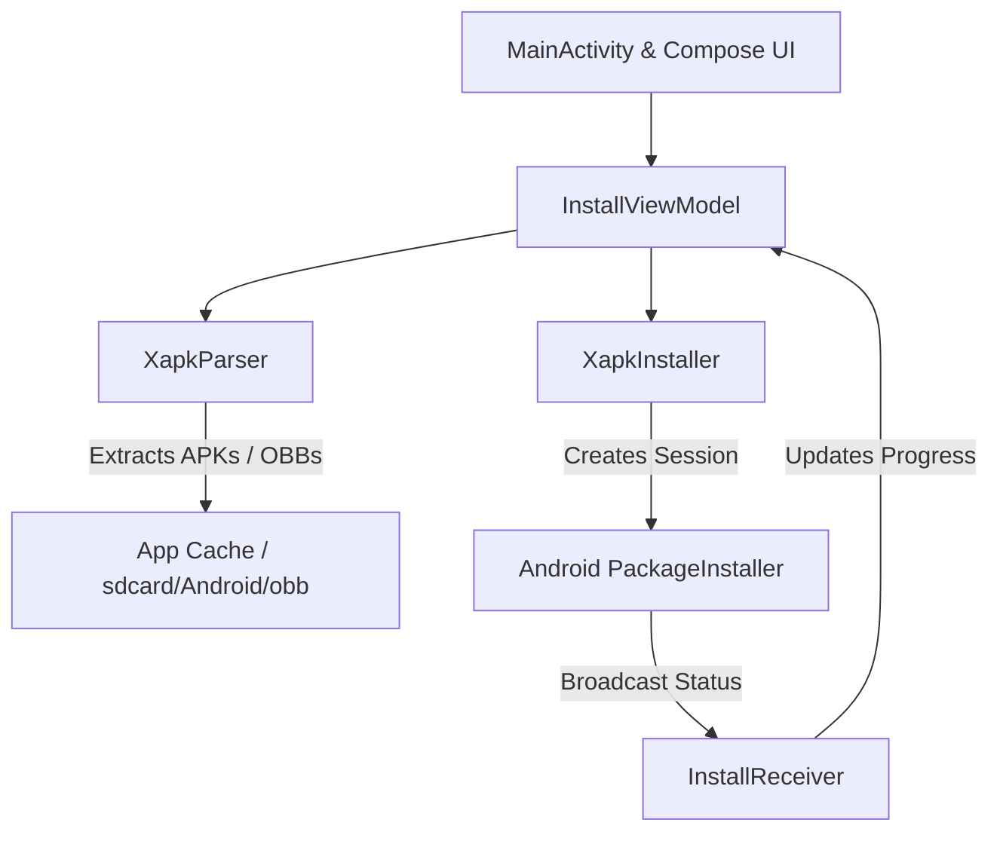

# Android XInstaller 📦🚀

An elegant, open-source Android application built with **Kotlin** and **Jetpack Compose** that installs XAPK files (Split APKs + OBB files) on Android devices.

*Aplikasi Android open-source yang elegan dibuat dengan Kotlin dan Jetpack Compose untuk menginstal file XAPK (Split APK & data OBB) secara langsung di perangkat Android.*

---

## 📥 Download APK (Siap Pakai)

Jika Anda adalah pengguna yang hanya ingin menggunakan aplikasi ini tanpa perlu mengompilasi kode sendiri:
1. Pergi ke halaman **Releases** di repositori GitHub ini.
2. Unduh file **`XInstaller.apk`** dari rilis terbaru.
3. Pasang langsung di HP Android Anda.

*(Download the pre-compiled **`XInstaller.apk`** from the **Releases** tab on this GitHub repository and install it directly on your Android phone.)*

---

## Features | Fitur

- **Modern & Premium UI/UX**: Dark mode by default, glassmorphic elements, smooth micro-animations, and clean layouts.
- **XAPK Support**: Parses, extracts, and installs `.xapk` files containing base APKs, split config APKs, and OBB asset files.
- **PackageInstaller Session API**: Uses the official Android `PackageInstaller` API for installing split APKs reliably.
- **Scoped Storage Handling**: Requests **All Files Access (`MANAGE_EXTERNAL_STORAGE`)** on Android 11+ to place OBB files correctly.
- **Detailed Progress Tracker**: Shows live progress of file extraction and Android system installation.

---

## System Architecture | Arsitektur Kode

- **`MainActivity`**: Sets up Compose theme, triggers system file picker, and monitors permissions.
- **`InstallViewModel`**: The state holder that drives UI transitions based on installation progress.
- **`XapkParser`**: Extracts ZIP content, processes the `manifest.json`, and routes files.
- **`XapkInstaller`**: Orchestrates `PackageInstaller.Session` to perform multi-APK installations.
- **`InstallReceiver`**: Listens to system broadcasts for the result of the `PackageInstaller` session.

---

## Standalone Execution | Berjalan Mandiri Tanpa PC/ADB

> [!IMPORTANT]
> **No Computer / ADB Required at Runtime!**
> Aplikasi ini berjalan **100% secara lokal** di HP Android Anda. Anda **TIDAK** membutuhkan komputer, koneksi ADB, root, atau Shizuku untuk menginstal file XAPK. Proses ekstraksi dan instalasi dilakukan langsung menggunakan API sistem Android (`PackageInstaller`).

---

## Build & Compile Options | Cara Mengompilasi APK

Karena ini proyek open-source, Anda memiliki dua cara untuk mengompilasi kode ini menjadi aplikasi `.apk` siap pakai:

### Opsi A: Menggunakan GitHub Actions (Tanpa Komputer/PC) - REKOMENDASI 🚀
Anda tidak memerlukan komputer sama sekali untuk mengompilasi aplikasi ini! Cukup gunakan fitur CI/CD GitHub:
1. Hubungkan proyek ini ke repositori GitHub Anda.
2. Setiap kali Anda melakukan **Push** kode ke GitHub, GitHub Actions akan otomatis membuatkan berkas `.apk` untuk Anda.
3. Buka halaman repositori GitHub Anda di HP, klik tab **Actions**, pilih alur build terbaru, dan unduh berkas APK-nya langsung dari bagian **Artifacts**.

### Opsi B: Menggunakan Android Studio (Menggunakan PC/Laptop)
Jika Anda ingin memodifikasi kode secara lokal di komputer:
1. Unduh proyek ini ke PC/Laptop Anda.
2. Buka Android Studio dan pilih **Open an Existing Project**, pilih folder root ini.
3. Hubungkan HP Android ke PC via USB (aktifkan USB Debugging) untuk menjalankan langsung dari Android Studio.

---

## License | Lisensi

This project is licensed under the **MIT License** - see the [LICENSE](LICENSE) file for details.
*Proyek ini dilisensikan di bawah Lisensi MIT - lihat berkas [LICENSE](LICENSE) untuk detailnya.*
